# SAGE Snapshot-to-Tree Conversion Plan

**Date**: 2025-08-01  
**Objective**: Convert SAGE from dual processing modes to single tree-based processing using legacy architecture as gold standard  
**Context**: Remove complexity of maintaining two parallel systems and adopt the proven legacy tree-based approach

---

## 📚 **Essential Background for New Developers**

### **What is SAGE?**
SAGE (Semi-Analytic Galaxy Evolution) is a galaxy formation model that processes cosmological merger trees to simulate galaxy evolution over cosmic time. It reads dark matter halo merger trees and applies physics to evolve galaxies within those halos.

### **Why Does This Conversion Matter?**
The current codebase maintains two parallel processing systems that do essentially the same thing:
- **Snapshot-based**: Processes galaxies by cosmological time (z=high → z=0)
- **Tree-based**: Processes galaxies by following merger tree branches (depth-first)

This creates maintenance burden, duplicate code, and complexity. The **legacy SAGE** (in `src-legacy/`) used only tree-based processing and is scientifically proven.

### **Key Concepts You Must Understand**

**Merger Trees**: Hierarchical structures showing how dark matter halos merge over time. Think family trees but for halos.

**FOF Groups**: Friends-of-Friends groups - clusters of halos that will eventually merge. Critical for galaxy evolution physics.

**Galaxy Types**: 
- Type 0: Central galaxy (sits in center of FOF group)
- Type 1: Satellite galaxy (orbits within a halo) 
- Type 2: Orphan galaxy (host halo disrupted, now free-floating)

**Property System**: Modern SAGE uses dynamic properties (`GALAXY_PROP_*` macros) instead of fixed struct fields. This enables physics-free mode and modular architecture.

**Core-Physics Separation**: Core infrastructure has no physics knowledge. Physics modules add functionality through callbacks and property system.

### **Current Issue (Why This Plan Exists)**
If you run SAGE now with tree-based processing (`ProcessingMode=1`), certain galaxy properties like `deltaMvir`, `infallMvir`, `infallVvir`, and `infallVmax` will retain their default values (0.0) and never get updated. These same properties are correctly calculated in snapshot-based processing (`ProcessingMode=0`).

**The Problem**: The current tree-based processing uses new functions (`inherit_galaxies_with_orphans()`, `update_galaxy_for_new_halo()`) that are **incomplete reimplementations** of the proven legacy logic. Meanwhile, the snapshot-based `copy_galaxies_from_progenitors()` is actually the **modernized legacy code** with property system integration.

**The Solution**: **Remove the incomplete tree-based functions** and adopt the legacy `construct_galaxies()` → `join_galaxies_of_progenitors()` structure, but using the **modernized snapshot-based implementation** that already has property system integration.

---

## 🎯 **Problem Statement**

Currently SAGE maintains two parallel processing systems:
1. **Snapshot-based processing** (ProcessingMode=0) - Modern but inefficient
2. **Tree-based processing** (ProcessingMode=1) - Attempt to replicate tree processing

Both systems duplicate functionality and create maintenance burden. However, **critical historical analysis** reveals that wholesale legacy adoption would be scientifically dangerous and architecturally regressive.

**Goal**: **Hybrid approach** - Adopt legacy **control flow and scientific algorithms** while preserving **5 phases of modern architectural achievements** (property system, memory safety, core-physics separation, module system).

**Key Insight**: The **snapshot-based processing is already the modernized legacy code** with property system integration and memory safety. The tree-based processing created new, incomplete functions instead of using this proven implementation. The solution is to adopt legacy **control flow** with **modern snapshot-based implementation**.

---

## 📋 **Legacy Architecture Analysis**

### **Legacy Tree-Based Flow (Gold Standard)**

```mermaid
flowchart TD
    A[🏁 sage_per_forest] --> B[load_forest<br/>Load tree files]
    B --> C[Allocate Gal, HaloGal, HaloAux arrays]
    C --> D[construct_galaxies<br/>Process main tree recursively]
    D --> E[Loop remaining halos<br/>Process unreachable sub-trees]
    E --> F[save_galaxies<br/>Write output]
    
    D --> G[join_galaxies_of_progenitors<br/>🔥 Galaxy inheritance & property updates]
    G --> H[evolve_galaxies<br/>🔥 Physics pipeline - direct call]
    
    style G fill:#ff9999
    style H fill:#ff9999
```


### **Critical File Locations (You MUST Read These)**

**Legacy Reference Code** (in `src-legacy/`):
- `src-legacy/core_build_model.c`: Lines 32-297 contain the GOLD STANDARD algorithms
- `src-legacy/sage.c`: Lines 277-392 show the main processing loop

**Modern Code to Understand** (in `src/`):
- `src/core/core_build_model.c`: Current snapshot/tree processing functions  
- `src/core/sage.c`: Main processing loop with ProcessingMode branching
- `src/core/core_allvars.h`: Property system definitions and GALAXY struct
- `src/properties.yaml`: Property definitions that drive code generation

**Key Helper Functions** (study these first):
- `deep_copy_galaxy()`: Safe galaxy copying (prevents memory corruption)
- `galaxy_array_append()`: Safe dynamic array expansion
- `GALAXY_PROP_*` macros: Property system access (in generated headers)

### **Function Evolution Analysis**
| **Legacy Function** | **Modern Snapshot-Based** | **Modern Tree-Based** | **Status** |
|---------------------|----------------------------|----------------------|------------|
| `construct_galaxies()` | ❌ Replaced with snapshot loops | ❌ Incomplete `process_tree_recursive()` | **MISSING** - Need to restore |
| `join_galaxies_of_progenitors()` | ✅ `copy_galaxies_from_progenitors()` (COMPLETE) | ❌ `inherit_galaxies_with_orphans()` (INCOMPLETE) | **REPLACE tree with snapshot** |
| `evolve_galaxies()` | ✅ Same function | ✅ Same function (via wrapper) | **KEEP** |

**Critical Insight**: The snapshot-based `copy_galaxies_from_progenitors()` **IS** the modernized `join_galaxies_of_progenitors()` with property system integration. The tree-based equivalents are incomplete reimplementations that should be removed.

### **Legacy Advantages (Control Flow & Algorithms)**
✅ **Single processing mode** - No dual system complexity  
✅ **Recursive tree traversal** - Natural depth-first processing  
✅ **Proven scientific algorithms** - Property calculations, FOF logic  
✅ **FOF-aware recursion** - Handles FOF dependencies elegantly  
✅ **Scientific accuracy** - Used in major publications  

### **Legacy Problems (Implementation Issues)**
❌ **Memory safety violations** - Dangerous shallow copying (`galaxies[ngal] = halogal[halonr]`)  
❌ **Hardcoded physics dependencies** - Core infrastructure contains physics knowledge  
❌ **Fixed property system** - Inflexible `struct GALAXY` approach  
❌ **Minimal error handling** - No corruption detection or fail-safe behavior  
❌ **No architectural separation** - Physics and core tightly coupled  

### **Modern Advantages (Must Preserve)**
✅ **Property system architecture** - Dynamic allocation, type-safe access, compile-time optimization  
✅ **Memory management** - Deep copying, corruption detection, fail-safe cleanup  
✅ **Core-physics separation** - 5 phases of architectural work, module independence  
✅ **Module system** - Pipeline phases, event communication, runtime configurability  
✅ **Scientific data integrity** - Fail-hard behavior prevents invalid results  
✅ **I/O interface abstraction** - Format-agnostic, property-based serialization  

---

## 🔧 **Hybrid Conversion Strategy** 

### **Phase 1: Legacy Control Flow with Modern Infrastructure**
Implement legacy processing patterns using modern property system, memory management, and architectural separation.

### **Phase 2: Scientific Algorithm Integration** 
Port legacy scientific calculations with modern error handling, property-based updates, and fail-safe behavior.

### **Phase 3: Module System Integration**
Integrate legacy processing with pipeline system, maintaining physics-free capability and module communication.

### **Phase 4: Cleanup and Validation**
Remove dual processing systems and validate scientific accuracy with comprehensive testing.

---

## 📝 **Detailed Implementation Plan**

### **PHASE 1: Legacy Control Flow with Modern Infrastructure** 

#### **1.1 Create Hybrid `construct_galaxies()`**
**Location**: `src/core/core_build_model.c`  
**Action**: Implement legacy recursive tree traversal with modern architectural safeguards

```c
int construct_galaxies(const int halonr, int *numgals, int *galaxycounter, 
                       GalaxyArray **working_galaxies, GalaxyArray **output_galaxies,
                       struct halo_data *halos, struct halo_aux_data *haloaux, 
                       struct params *run_params);
```

**TAKE from Legacy** (Control Flow Only):
- ✅ Recursive tree traversal pattern (`src-legacy/core_build_model.c:32-111`)
- ✅ FOF group processing order and logic
- ✅ `DoneFlag`/`HaloFlag` state management pattern

**DO NOT TAKE from Legacy** (Implementation Details):
- ❌ Raw array manipulation - use `GalaxyArray` instead
- ❌ Direct field access - use property system throughout  
- ❌ Physics hardcoding - maintain core-physics separation
- ❌ Dangerous memory patterns - use safe modern functions

**Call Pattern**: Use modernized `copy_galaxies_from_progenitors()` (not incomplete tree functions)

#### **1.2 Use Existing Modernized `copy_galaxies_from_progenitors()`**
**Location**: `src/core/core_build_model.c` (ALREADY EXISTS)  
**Action**: **DO NOT CREATE** - this function already contains the complete modernized legacy logic

**Current Implementation**: Already has everything needed:
- ✅ Most massive progenitor finding (exact legacy algorithm)
- ✅ Property update calculations with `GALAXY_PROP_*` macros (lines 186-263 equivalent)
- ✅ Modern memory safety with `deep_copy_galaxy()`
- ✅ Scientific data integrity with validation
- ✅ Central/satellite/orphan type classification

**Note**: This is the **gold standard implementation** - do not duplicate this logic elsewhere

#### **1.3 Create Hybrid `sage_per_forest()`**
**Location**: `src/core/sage.c`  
**Action**: Implement legacy processing flow with modern module system

```c
int32_t sage_per_forest(const int64_t forestnr, struct save_info *save_info,
                        struct forest_info *forest_info, struct params *run_params);
```

**Implementation**:
- **Legacy Flow**: Load forest, main tree processing, sub-tree loop from legacy lines 277-392
- **Modern Memory**: Use `GalaxyArray` system instead of raw pointer manipulation
- **Module Integration**: Call `evolve_galaxies_wrapper()` to preserve pipeline system
- **Error Handling**: Add comprehensive validation and fail-safe behavior
- **I/O Integration**: Use modern `save_galaxies()` with property-based output

### **PHASE 2: Scientific Algorithm Integration**

#### **2.1 Property-Based Scientific Calculations**
**Legacy Algorithms**: Port critical property calculations from legacy lines 186-263  
**Modern Implementation**: 
- `GALAXY_PROP_deltaMvir(galaxy) = new_mvir - previous_mvir` (property-based)
- `GALAXY_PROP_infallMvir/Vvir/Vmax(galaxy)` for central→satellite transitions
- Galaxy type assignment via `GALAXY_PROP_Type(galaxy)` with validation
- **Critical**: Maintain exact scientific formulas while using property system

#### **2.2 Enhanced Error Handling**
**Legacy Gaps**: Add missing validation and corruption detection  
**Modern Enhancements**:
- Validate all property calculations before assignment
- Add bounds checking for physical quantities (masses, velocities, radii)
- Implement fail-hard behavior for scientific data corruption
- Add debugging traces for complex calculations (deltaMvir, merger times)

#### **2.3 Memory Safety in Scientific Code**
**Legacy Problem**: Dangerous shallow copying creates pointer aliasing  
**Modern Solution**:
- Replace `galaxies[ngal] = halogal[source]` with `deep_copy_galaxy()`
- Use `galaxy_array_append()` for safe dynamic expansion
- Implement proper cleanup with `free_galaxy_properties()`
- Add memory corruption detection at galaxy copy points

### **PHASE 3: Module System Integration**

#### **3.1 Pipeline System Preservation**
**Legacy Issue**: Direct `evolve_galaxies()` call bypasses module system  
**Modern Solution**:
- Use `evolve_galaxies_wrapper()` to maintain pipeline phases
- Preserve HALO→GALAXY→POST→FINAL execution order
- Maintain event-driven inter-module communication
- Ensure physics-free mode capability remains functional

#### **3.2 Module Communication Integration**
**Legacy Gap**: No inter-module communication or event system  
**Modern Enhancement**:
- Integrate module callbacks at appropriate points in legacy flow
- Preserve event dispatch for merger processing, infall calculation
- Maintain module registration and lifecycle management
- Ensure modules can access galaxy state through property system

#### **3.3 Configuration-Driven Processing**
**Legacy Limitation**: No runtime configurability  
**Modern Advantage**:
- Preserve JSON-based module activation/deactivation
- Maintain physics-free vs full-physics build configurations
- Keep property system configurability (`make physics-free`, `make full-physics`)
- Ensure module selection works with legacy control flow

### **PHASE 4: Cleanup and Validation**

#### **4.1 Remove Dual Processing Systems**
**Files to Remove**:
- `src/core/tree_*.c` and `src/core/tree_*.h` (incomplete tree implementations - code bloat)
- `src/core/core_snapshot_indexing.*` (entire snapshot indexing module)
- ProcessingMode parameter and conditional branching

**Functions to Remove**:
- ❌ `inherit_galaxies_with_orphans()` - incomplete reimplementation
- ❌ `update_galaxy_for_new_halo()` - unnecessary code bloat
- ❌ `process_tree_fof_group()`, `collect_halo_galaxies()` - incomplete implementations
- ✅ **KEEP** `copy_galaxies_from_progenitors()` - this IS the modernized legacy code

#### **4.2 Scientific Validation**
**Critical Requirements**:
- Compare output with legacy SAGE results (galaxy counts, mass functions)
- Validate property calculations match legacy formulas exactly
- Test merger processing, infall physics, galaxy type transitions
- Ensure no regression in scientific accuracy during architectural improvements

### **PHASE 4: Integration and Testing**

#### **4.1 Unit Testing**
- Test `construct_galaxies()` with simple tree structures
- Test `join_galaxies_of_progenitors()` with known progenitor setups
- Validate property updates match expected values
- Test FOF group processing

#### **4.2 End-to-End Testing**
- Run on Millennium test data
- Compare outputs with legacy SAGE results
- Validate galaxy counts, mass functions, merger statistics
- Performance benchmarking vs current systems

#### **4.3 Memory and Performance Validation**
- Memory leak detection with `MEM-CHECK=yes`
- Profile memory usage patterns
- Benchmark processing speed
- Validate scientific accuracy

#### **4.4 Update Technical Documentation**
- After the refactoring is complete and validated, review and update all relevant documentation in the docs/ directory. 
- Specifically, `SAGE_Tree_FOF_Processing_Technical_Reference.md` will need to be rewritten to reflect the new, unified logic. 
- The `ProcessingMode` parameter should be removed from user-facing documentation like `README.md` or parameter file examples.

---

## 📂 **File Modifications Required**

### **Modified Files**
| **File** | **Modification Type** | **Description** |
|----------|----------------------|-----------------|
| `src/core/sage.c` | **Major Rewrite** | Replace dual processing with legacy architecture |
| `src/core/core_build_model.c` | **Major Rewrite** | Add legacy functions, remove snapshot/tree functions |
| `src/core/core_build_model.h` | **Update** | New function declarations |
| `input/*.par` | **Minor** | Remove ProcessingMode parameter |
| `Makefile` | **Minor** | Remove tree_*.o targets |

### **Removed Files** 
- `src/core/tree_*.c` and `src/core/tree_*.h` (9 files)
- `src/core/core_snapshot_indexing.*` (2 files)
- `src/core/sage_tree_mode.c` (1 file)

### **New Files**
- None (using existing file structure)

---

## ⚠️ **Critical Implementation Notes**

## 🛠️ **Development Workflow for New Developers**

### **Before You Start Coding**
1. **Read the legacy code first**: Understand `src-legacy/core_build_model.c` lines 32-297 completely
2. **Run current system**: Execute `make clean && make && ./sage ./input/millennium.par` to see how it works
3. **Understand property system**: Study how `GALAXY_PROP_*` macros work vs direct field access  
4. **Set up debugging**: Run `./codesign-sage.sh` for enhanced debugging, learn lldb basics

### **Testing Strategy**
- **Unit tests**: Test individual functions with `make <test-name> && ./tests/<test-name>`
- **Full runs**: Use small test data in `tests/test_data/` before full Millennium runs
- **Memory checking**: Always use `MEM-CHECK=yes` during development
- **Property validation**: Check property values are reasonable (no NaN, negative masses, etc.)

### **Common Pitfalls (Learn From History)**
1. **Never shallow copy galaxies**: `galaxies[i] = source` creates pointer aliasing and corruption
2. **Always use property macros**: Direct field access breaks core-physics separation  
3. **Validate scientific calculations**: Bounds check masses, velocities, times before assignment
4. **Don't mask corruption**: If data is invalid, fail hard - never use default values
5. **Check FOF logic carefully**: Central galaxy assignment is critical and easy to break

### **When You Get Stuck**
- **Check log files**: `log/README.md` has current context and historical decisions
- **Memory corruption**: Use `lldb -s debug_commands.txt ./sage input/millennium.par`
- **Property issues**: Check `src/properties.yaml` and generated headers
- **Scientific validation**: Compare outputs with legacy SAGE results

---

## ⚠️ **Critical Implementation Notes**

### **1. Use Existing Modernized Legacy Code (ESSENTIAL)**
**Current Problem**: Tree-based processing created new, incomplete functions instead of using the proven modernized legacy implementation.

**DO NOT**: Create new functions or enhance incomplete tree functions  
**DO**: Use existing `copy_galaxies_from_progenitors()` which already contains complete legacy algorithms:

```c
// ❌ WRONG APPROACH (creating new/incomplete functions)
void update_galaxy_for_new_halo(...) { /* incomplete logic */ }
int inherit_galaxies_with_orphans(...) { /* missing calculations */ }

// ✅ CORRECT APPROACH (use existing modernized legacy code)
// copy_galaxies_from_progenitors() in core_build_model.c lines 151-290
// This already contains:
// - deltaMvir calculation (line 224)
// - infallMvir/Vvir/Vmax tracking (lines 235-238)  
// - Property system integration (GALAXY_PROP_* macros throughout)
// - Memory safety (deep_copy_galaxy)
// - Complete central/satellite/orphan logic
```

**Key Point**: The modernized legacy code **already exists** - don't recreate it!

### **2. Memory Safety is Non-Negotiable**
**Legacy Danger**: `galaxies[ngal] = halogal[source]` creates pointer aliasing and corruption  
**Modern Requirement**: Use `deep_copy_galaxy(galaxy_dest, galaxy_src, run_params)` for all galaxy copying

### **3. Scientific Data Integrity**
Based on historical lessons, **fail-hard behavior is required**:
- Validate all property calculations before assignment
- Add bounds checking for physical quantities  
- **Never** mask corruption with default values
- Use `XRETURN()` or similar for scientific validation failures

### **4. Core-Physics Separation Must Be Preserved**
**Legacy Violation**: Hardcoded physics knowledge throughout core  
**Modern Requirement**: All physics access through property system and module callbacks

### **5. FOF Group Processing Enhancement**
**Legacy Logic**: State flag management (`HaloFlag`, `DoneFlag`)  
**Modern Enhancement**: Add validation, error handling, and fail-safe behavior to flag management

### **6. Module System Integration**
**Legacy Gap**: Direct function calls bypass modern architecture  
**Modern Requirement**: Use `evolve_galaxies_wrapper()` to preserve pipeline system and module communication

### **7. Historical Lessons Integration (CRITICAL)**
Based on 5 phases of development documented in logs:

**Never Mask Scientific Corruption**: If data is invalid, fail hard immediately - never substitute default values or "gracefully degrade". Quote from logs: *"you cannot do this! You are changing scientific data just to make the code run!"*

**Preserve Architectural Separation**: The legacy code has hardcoded physics knowledge throughout core infrastructure. The modern codebase spent 5 phases eliminating this. We must not reintroduce physics violations by wholesale legacy copying.

**Memory Management Sophistication**: Legacy uses dangerous patterns (`galaxies[ngal] = halogal[source]`) that create pointer aliasing and corruption. Modern code has sophisticated fixes that must be preserved.

**FOF Processing Fragility**: Legacy FOF group handling has critical bugs requiring complex flag management fixes (`HaloFlag`/`DoneFlag` forest-level initialization, central galaxy assignment validation).

---

## 🎯 **Success Criteria**

✅ **Single Processing Mode**: No more dual snapshot/tree systems  
✅ **Scientific Accuracy**: Results match legacy SAGE within tolerance while using modern property system  
✅ **Memory Safety**: No memory leaks, corruption detection, safe galaxy copying  
✅ **Architectural Preservation**: Core-physics separation, module system, pipeline phases maintained  
✅ **Performance**: At least equivalent to current tree-based performance  
✅ **Code Quality**: Enhanced error handling, validation, fail-safe behavior  
✅ **Modern Features**: Property system, modules, HDF5 output, physics-free mode all working  

## 🌟 **Hybrid Approach Benefits**

**Best of Both Worlds**:
- **Legacy Control Flow**: Proven recursive tree traversal, FOF handling, scientific algorithms
- **Modern Architecture**: Property system, memory safety, core-physics separation, module system

**Risk Mitigation**:
- **Preserves 5 phases of architectural work**: No regression in separation, modularity, configurability
- **Maintains scientific data integrity**: Fail-hard behavior, corruption detection, validation
- **Enhances legacy robustness**: Error handling, memory safety, bounds checking

**Future-Proof Design**:
- **Module system compatibility**: Physics modules can be added/modified without core changes
- **Property system flexibility**: New properties can be added without structural changes  
- **I/O interface abstraction**: Multiple tree formats supported without legacy coupling

## ⚠️ **Critical "DO NOT" List (From Historical Lessons)**

**DO NOT** copy these legacy patterns - they were identified as dangerous during 5 phases of development:

❌ **Direct Field Access**: `galaxies[i].Mvir = value` - violates core-physics separation  
❌ **Shallow Copying**: `galaxies[ngal] = halogal[source]` - creates memory corruption  
❌ **Raw Array Management**: `realloc()` patterns - use `GalaxyArray` system instead  
❌ **Physics Hardcoding**: Core functions with embedded physics knowledge  
❌ **Corruption Masking**: Setting invalid data to defaults instead of fail-hard behavior  
❌ **Fragile FOF Logic**: Legacy flag management has critical bugs requiring modern fixes  

**The hybrid approach takes ONLY the proven scientific logic and control flow, never the dangerous implementation patterns.**  

---

## 📅 **Implementation Timeline**

**Phase 1**: 3-4 days (Legacy control flow with modern infrastructure)  
**Phase 2**: 2-3 days (Scientific algorithm integration with property system)  
**Phase 3**: 2-3 days (Module system integration and pipeline preservation)  
**Phase 4**: 3-4 days (Cleanup, validation, and scientific accuracy testing)  

**Total Estimated Time**: 10-14 days

*Note: Timeline extended from original due to hybrid approach complexity, but this ensures preservation of 5 phases of architectural work and scientific data integrity*

---

## 💡 **Concrete Implementation Examples**

### **Example 1: Safe Galaxy Copying Pattern**
```c
// LEGACY (DANGEROUS - creates pointer aliasing)
galaxies[ngal] = halogal[source_idx];

// MODERN (SAFE - proper deep copy)
struct GALAXY temp_galaxy;
memset(&temp_galaxy, 0, sizeof(struct GALAXY));
galaxy_extension_initialize(&temp_galaxy);
deep_copy_galaxy(&temp_galaxy, &halogal[source_idx], run_params);
// ... modify temp_galaxy properties ...
galaxy_array_append(working_galaxies, &temp_galaxy, run_params);
free_galaxy_properties(&temp_galaxy);
```

### **Example 2: Property-Based Scientific Calculations**
```c
// LEGACY (DANGEROUS - direct field access)
galaxies[ngal].deltaMvir = get_virial_mass(halonr, halos, run_params) - galaxies[ngal].Mvir;
galaxies[ngal].infallMvir = previousMvir;

// MODERN (SAFE - property-based with validation)
const float new_mvir = get_virial_mass(halonr, halos, run_params);
const float delta_mvir = new_mvir - GALAXY_PROP_Mvir(galaxy);

// Validate before assignment
if (isnan(delta_mvir) || !isfinite(delta_mvir)) {
    LOG_ERROR("Invalid deltaMvir calculation: %f", delta_mvir);
    return EXIT_FAILURE;
}

GALAXY_PROP_deltaMvir(galaxy) = delta_mvir;
GALAXY_PROP_infallMvir(galaxy) = previousMvir;
```

### **Example 3: FOF Group Processing Pattern**
```c
// From legacy, but with modern error handling
haloaux[halonr].DoneFlag = 1;

// Process all progenitors first (legacy logic)
int prog = halos[halonr].FirstProgenitor;
while (prog >= 0) {
    if (haloaux[prog].DoneFlag == 0) {
        int status = construct_galaxies(prog, numgals, galaxycounter, 
                                      working_galaxies, output_galaxies,
                                      halos, haloaux, run_params);
        if (status != EXIT_SUCCESS) {
            LOG_ERROR("Failed to process progenitor halo %d", prog);
            return status; // Modern error handling
        }
    }
    prog = halos[prog].NextProgenitor;
}
```

---

## 🚨 **Troubleshooting Guide**

### **Compilation Errors**
- **Property not found**: Check `src/properties.yaml` and regenerate headers with `make`
- **Function not found**: Ensure modern helper functions are included (`#include "core_array_utils.h"`)
- **Type mismatches**: Use explicit casts for property access (`(float)GALAXY_PROP_Mvir(galaxy)`)

### **Runtime Crashes**
- **Segmentation fault**: Usually memory corruption - check galaxy copying patterns
- **Invalid property access**: Use `lldb` to trace property pointer validity
- **FOF errors**: Check central galaxy assignment and `CentralGal` indices

### **Scientific Validation Failures**
- **Properties retain default values**: Tree-based processing missing critical property updates in `update_galaxy_for_new_halo()`
- **deltaMvir always 0.0**: Not calculated in current tree-based implementation
- **infallMvir/Vvir/Vmax always 0.0**: Infall property tracking missing from tree-based processing  
- **Galaxy counts wrong**: Check orphan creation logic and merger processing
- **Mass conservation**: Verify `deltaMvir` calculations match legacy exactly

### **Performance Issues**
- **Memory leaks**: Use `MEM-CHECK=yes` and check `free_galaxy_properties()` calls
- **Slow execution**: Profile with `gprof` or check for O(n²) loops in galaxy copying

---

## 🚨 **Risks and Mitigation**

**Risk**: Property system integration complexity  
**Mitigation**: Start with core properties, add extended properties incrementally

**Risk**: Module system compatibility  
**Mitigation**: Keep existing `evolve_galaxies()` signature, modify calling pattern only

**Risk**: Performance regression  
**Mitigation**: Benchmark at each phase, profile critical sections

**Risk**: Scientific accuracy deviation  
**Mitigation**: Extensive validation against legacy results, tolerance testing

---

---

## 🎉 **Conclusion**

This **hybrid conversion plan** learns from the extensive historical journey documented in the logs. Rather than naively copying legacy code and losing 5 phases of sophisticated development work, we adopt a thoughtful approach that:

**Preserves Scientific Accuracy**: Legacy algorithms and control flow patterns ensure scientific correctness  
**Maintains Modern Robustness**: Property system, memory safety, and error handling prevent regression  
**Respects Architectural Evolution**: Core-physics separation and module system remain intact  
**Enhances Code Quality**: Add validation, bounds checking, and fail-safe behavior missing from legacy  

**The result will be a single, robust, scientifically accurate tree-based processing system that combines the best aspects of both legacy and modern implementations - exactly what 5 phases of development have been working toward.**

---

## 🚀 **Quick Start for New Developers**

### **Immediate Next Steps**
1. **Verify the current issue**: Run `make clean && make && ./sage ./input/millennium.par` and check that `deltaMvir` properties are 0.0 in output
2. **Study the working solution**: Compare snapshot-based `copy_galaxies_from_progenitors()` lines 186-263 in `core_build_model.c` 
3. **Study the legacy reference**: Read `src-legacy/core_build_model.c` lines 186-263 for the gold standard property calculations
4. **Identify the gap**: Look at tree-based `update_galaxy_for_new_halo()` in `tree_galaxies.c` and see what's missing

### **First Implementation Task**
Start with **Phase 1.1**: Create hybrid `construct_galaxies()` function that:
- Uses legacy recursive tree traversal pattern (control flow only)
- Calls existing `copy_galaxies_from_progenitors()` (do NOT recreate this logic)
- Uses `GalaxyArray` infrastructure instead of raw arrays
- Maintains all modern architectural safeguards (property system, memory safety, etc.)

**DO NOT**: Try to enhance `update_galaxy_for_new_halo()` - this function should be removed as unnecessary code bloat

### **Success Validation**
After your first changes, run SAGE and verify that:
- `deltaMvir` values are non-zero and reasonable
- `infallMvir/Vvir/Vmax` are set for galaxies that transition from central to satellite
- No segmentation faults or property corruption

This plan provides the complete roadmap, but start small and build confidence with the property system integration first.