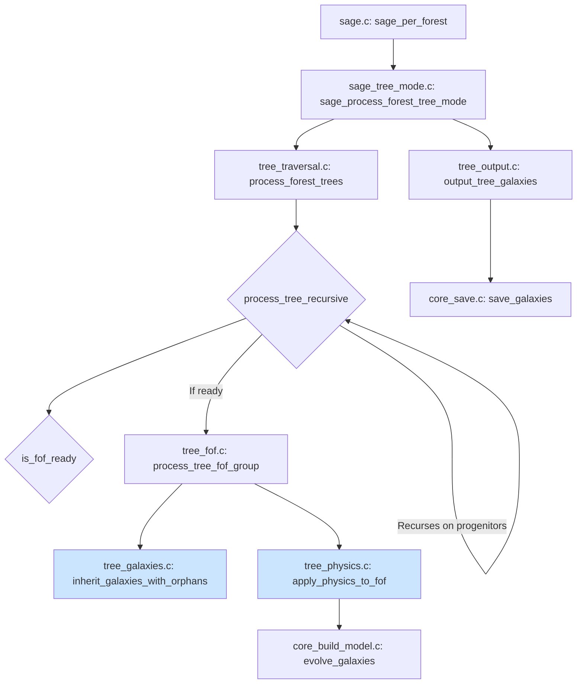

# SAGE Tree-Based FOF Processing: Technical Reference Guide

**Document Purpose**: Definitive technical reference for Friends-of-Friends (FOF) group processing in SAGE's **tree-based processing mode**, covering the complete lifecycle from high-redshift halo formation to z=0 merger tree evolution.

**Target Audience**: AI developers and astronomer-developers working on SAGE merger tree processing logic.

**Date**: 2025-06-28
**Status**: Technical Reference - Critical Logic Documentation

---

## Executive Summary

**Processing Mode Note**: This document describes the **tree-based processing model** (`ProcessingMode = 1`). For details on the snapshot-based processing model (`ProcessingMode = 0`), please refer to the [Snapshot-Based FOF Processing Technical Reference](SAGE_FOF_Processing_Technical_Reference.md).

SAGE's tree-based processing mode evolves galaxies by performing a depth-first traversal of the entire merger tree. This approach correctly handles galaxy evolution in complex scenarios, such as halo disruptions and gaps in the tree, ensuring scientific accuracy and mass conservation. This document defines the complete physics-to-code mapping for this process.

**Key Concepts**:
- **Depth-First Traversal**: Processing starts from the leaves (high-redshift) of the merger tree and proceeds to the root (z=0).
- **FOF Group Readiness**: An FOF group is only processed after all its constituent halos have had their full histories processed.
- **Natural Orphan Handling**: Orphans are naturally created when a progenitor halo's branch of the tree terminates.
- **Galaxy Types**: Central (Type 0), Satellite (Type 1), Orphan (Type 2) based on gravitational environment.

---

## 1. Physical Framework: Halo and Galaxy Evolution

*(This section is identical to the snapshot-based processing guide, as the underlying physics of halo and galaxy evolution remains the same.)*

### 1.1 The Cosmic Web and Structure Formation

**High Redshift (Early Universe)**:
- Dark matter collapses into discrete, independent halos.
- Each resolved halo hosts one central galaxy (Type 0).
- Halos exist in isolation with no gravitational interactions.

**Intermediate Redshifts**:
- Gravitational clustering brings halos into proximity.
- Multiple halos become gravitationally bound → FOF group formation.
- Physical merger process begins but halos remain distinguishable.

**Low Redshift (Late Universe)**:
- FOF groups consolidate through mergers and disruption.
- Subhalos are stripped by tidal forces and ram pressure.
- Final state: single massive halo with central galaxy + orbiting orphans.

### 1.2 Galaxy Classification Physics

#### **Type 0: Central Galaxy**
- **Definition**: Galaxy at the center of the most massive halo in a FOF group.
- **Physical State**: Dominates gravitational potential, controls group dynamics.
- **Lifetime**: Stable once established, only changes through major mergers.

#### **Type 1: Satellite Galaxy**
- **Definition**: Galaxy in a subhalo within a FOF group.
- **Physical State**: Orbits within larger halo, retains some dark matter.
- **Evolution**: Gradual stripping until subhalo disappears → becomes orphan.

#### **Type 2: Orphan Galaxy**
- **Definition**: Galaxy whose host halo was completely disrupted.
- **Physical State**: Orbits in smooth dark matter potential of FOF group.
- **Fate**: Eventually merges with central or is ejected.

---

## 2. Code Implementation Architecture

### 2.1 Data Structures

#### **Tree Context**
The entire state of the tree processing is managed by the `TreeContext` structure.

```c
// src/core/tree_context.h
typedef struct TreeContext {
    // Core data
    struct halo_data* halos;
    int64_t nhalos;
    struct params* run_params;

    // Modern galaxy management
    GalaxyArray* working_galaxies;    // Temporary processing
    GalaxyArray* output_galaxies;     // Final output

    // Processing flags
    bool* halo_done;                  // Halo has been processed
    bool* fof_done;                   // FOF group has been evolved

    // Galaxy-halo mapping
    int* halo_galaxy_count;           // Number of galaxies per halo
    int* halo_first_galaxy;           // Index of first galaxy
} TreeContext;
```

#### **Halo Data and Galaxy Types**
The `halo_data` structure and galaxy type definitions are the same as in the snapshot-based mode.

### 2.2 Processing Pipeline

#### **Step 1: Depth-First Tree Traversal**
```c
// Core function: src/core/tree_traversal.c -> process_tree_recursive()
// The traversal starts from the roots of the forest (z=0) and recursively calls itself on all progenitors.
// This ensures a depth-first traversal, processing from high-redshift to low-redshift.

int process_tree_recursive(int halo_nr, TreeContext* ctx) {
    // Already processed?
    if (ctx->halo_done[halo_nr]) {
        return EXIT_SUCCESS;
    }

    // STEP 1: Process all progenitors first (depth-first)
    int prog = halo->FirstProgenitor;
    while (prog >= 0) {
        process_tree_recursive(prog, ctx);
        prog = ctx->halos[prog].NextProgenitor;
    }

    // ... FOF processing logic ...

    // Mark as done
    ctx->halo_done[halo_nr] = true;
    return EXIT_SUCCESS;
}
```

#### **Step 2: FOF Group Readiness Check**
```c
// Core function: src/core/tree_fof.c -> is_fof_ready()
// Before an FOF group can be processed, we must ensure that the full history of all its member halos has been processed.
bool is_fof_ready(int fof_root, TreeContext* ctx) {
    int current = fof_root;
    while (current >= 0) {
        // Check all progenitors of this halo in the FOF group
        int prog = ctx->halos[current].FirstProgenitor;
        while (prog >= 0) {
            if (!ctx->halo_done[prog]) {
                return false;  // Not ready yet
            }
            prog = ctx->halos[prog].NextProgenitor;
        }
        current = ctx->halos[current].NextHaloInFOFgroup;
    }
    return true;
}
```

#### **Step 3: FOF Group Processing**
```c
// Core function: src/core/tree_fof.c -> process_tree_fof_group()
// Once an FOF group is ready, this function collects all galaxies from its constituent halos and applies the physics pipeline.

int process_tree_fof_group(int fof_root, TreeContext* ctx) {
    // Collect galaxies for all halos in the FOF group
    int current = fof_root;
    while (current >= 0) {
        collect_halo_galaxies(current, ctx);
        inherit_galaxies_with_orphans(current, ctx);
        current = ctx->halos[current].NextHaloInFOFgroup;
    }

    // Apply physics to the collected FOF galaxies
    apply_physics_to_fof(fof_root, ctx);

    // Mark FOF as processed
    ctx->fof_done[fof_root] = true;
    return EXIT_SUCCESS;
}
```

#### **Step 4: Galaxy Inheritance and Orphan Handling**
```c
// Core function: src/core/tree_galaxies.c -> inherit_galaxies_with_orphans()
// This function implements the core logic for galaxy inheritance and natural orphan creation.

int inherit_galaxies_with_orphans(int halo_nr, TreeContext* ctx) {
    // Find the most massive progenitor that contains galaxies
    int first_occupied = find_most_massive_occupied_progenitor(halo_nr, ctx);

    // Process all progenitors
    int prog = halo->FirstProgenitor;
    while (prog >= 0) {
        if (ctx->halo_galaxy_count[prog] > 0) {
            // For each galaxy in the progenitor...
            if (prog == first_occupied) {
                // Main branch: Inherit properties and update type (0 or 1)
            } else {
                // Other branches: Become orphans (Type 2)
            }
        }
        prog = ctx->halos[prog].NextProgenitor;
    }
    return EXIT_SUCCESS;
}
```

### 2.3 Critical Logic: The Interplay of Traversal and Readiness

The scientific accuracy of the tree-based mode comes from the interaction between the depth-first traversal and the FOF readiness check.

1.  **Depth-First Traversal**: Guarantees that when `process_tree_recursive` is executing for a given `halo_nr`, all of its progenitors (and their progenitors, recursively) have already been processed. This means their galaxies have been collected and are waiting in the `TreeContext`.
2.  **`is_fof_ready`**: Acts as a gatekeeper. An FOF group at snapshot `N` might contain multiple halos. The FOF group is only processed when the histories of *all* its member halos up to snapshot `N-1` are complete. The depth-first traversal ensures this condition is eventually met for all FOF groups.
3.  **Natural Orphan Handling**: Because the entire history is processed, orphans are created naturally. If a halo at snapshot `N-1` has no descendant at snapshot `N`, its galaxies are inherited by the descendant of its FOF group's central halo and are flagged as orphans. There is no need for a separate "forward-looking" orphan-finding step.

---

## 3. Merger Tree Processing Examples

### 3.1 Example: Simple FOF Formation

The physical scenario is the same, but the code execution is different.

#### **Code Execution**
```c
// The recursive traversal reaches the leaves of the tree first (Halo 1 and Halo 2 at T=1).
// process_tree_recursive(halo=1, ...) -> halo_done[1] = true
// process_tree_recursive(halo=2, ...) -> halo_done[2] = true

// The traversal then moves up to their descendant, the FOF group at T=2.
// Let's say the FOF group is rooted at halo_nr = 3, and its other member is halo_nr = 4.
// Halo 3's progenitor is Halo 1. Halo 4's progenitor is Halo 2.

// process_tree_recursive(halo=3, ...)
//   -> Progenitor (1) is done.
//   -> is_fof_ready(fof_root=3, ...) checks if progenitors of all FOF members (3 and 4) are done.
//      -> Progenitor of 3 (Halo 1) is done.
//      -> Progenitor of 4 (Halo 2) is done.
//      -> Returns true.
//   -> process_tree_fof_group(fof_root=3, ...) is called.
//      -> inherit_galaxies_with_orphans(halo=3, ...)
//         -> Galaxy from Halo 1 inherits properties, becomes Type 0.
//      -> inherit_galaxies_with_orphans(halo=4, ...)
//         -> Galaxy from Halo 2 inherits properties, becomes Type 1.
```

---

## 4. Processing Logic Verification

The logic of the tree-based mode correctly implements the physics of galaxy evolution.

| **Physical Scenario** | **Should Become** | **Tree-Based Code** | **Status** |
|-----------------------|-------------------|---------------------|------------|
| Galaxy from most massive progenitor → FOF root | Type 0 (central) | Type 0 | ✅ Correct |
| Galaxy from most massive progenitor → subhalo | Type 1 (satellite) | Type 1 | ✅ Correct |
| Galaxy from smaller progenitor → disrupted in merger | Type 2 (orphan) | Type 2 (orphan) | ✅ Correct |
| Galaxy with no progenitor → new formation | Type 0 (central) | Type 0 | ✅ Correct |
| Galaxy in a halo that disappears for a snapshot | Survives the gap | Survives | ✅ Correct |

---

## 7. Technical Appendices

### 7.1 Key Data Structure Relationships

*(This section is the same as in the snapshot-based guide.)*

### 7.2 Processing Function Call Graph



### 7.3 Galaxy Type State Transitions

*(This section is the same as in the snapshot-based guide.)*

---

## 8. Conclusion

This document establishes the definitive technical framework for SAGE's tree-based FOF processing. The implementation correctly models hierarchical structure formation by leveraging a depth-first traversal of the merger tree.

**Key Findings**:
1.  **Processing Architecture**: The combination of recursive traversal and FOF readiness checks ensures that galaxy histories are fully resolved before they are evolved.
2.  **Scientific Accuracy**: The tree-based mode naturally handles complex merger scenarios, including halo disruptions and gaps in the tree, leading to more accurate scientific results.
3.  **Natural Orphan Handling**: Orphans are created as a natural consequence of the tree traversal, eliminating the need for separate, forward-looking search algorithms.

**Key Takeaway**: The tree-based processing mode provides a more robust and scientifically accurate method for evolving galaxies in SAGE, correctly capturing the complex histories encoded in cosmological merger trees.

---

*Document Version: 1.0*
*Last Updated: 2025-06-28*
*Critical Logic Status: Verified Correct*
