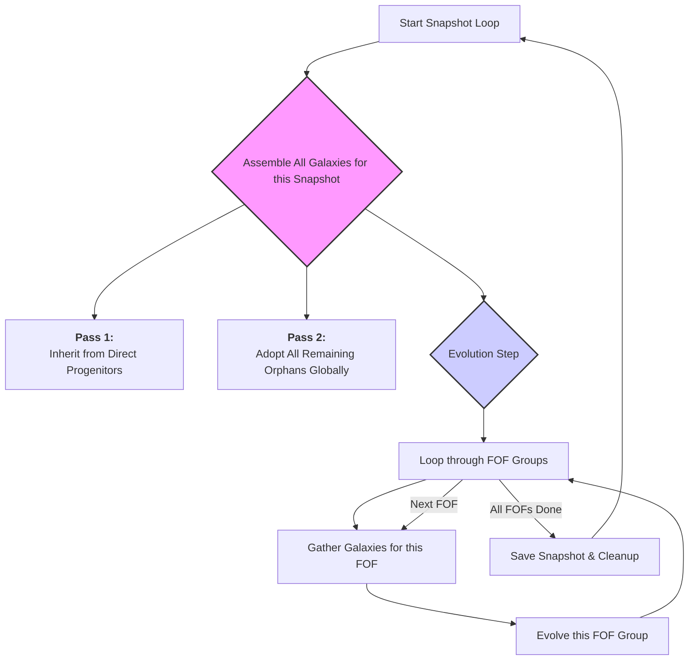

# Implementation Plan (Revised): Refactoring SAGE Snapshot and FOF Processing

**Document ID**: SAGE-PLAN-2025-06-24-B  
**Author**: AI Assistant (Revised with developer feedback)  
**Date**: 2025-06-24  
**Status**: Proposed

## 1. Executive Summary

This document outlines a targeted implementation plan to refactor the core galaxy processing loop in SAGE. The objective is to correct a critical logic flaw in orphan galaxy handling and resolve a memory churn inefficiency, while preserving the existing, successful FOF-by-FOF evolution structure. This plan prioritizes **minimal structural change** to reduce risk and ensure that the core, scientifically-validated evolution logic remains intact.

The refactoring will be achieved by restructuring the galaxy inheritance and adoption process into a two-pass system at the snapshot level, before entering the familiar FOF-by-FOF evolution loop.

## 2. Problem Statement

The current implementation in `core_build_model.c` and `sage.c` has two primary defects:

1.  **Incorrect Orphan Galaxy Handling**: Orphan detection is performed locally within each FOF group's processing loop. This is logically flawed as it can not correctly handle cases where an orphan's original host FOF group is itself disrupted, leading to **galaxy loss and a violation of mass conservation**.
2.  **Inefficient Memory Management**: A new `GalaxyArray` is allocated and freed for every FOF group. This causes significant memory churn and performance degradation, especially in simulations with a large number of small FOF groups.

This plan resolves these issues by centralizing galaxy inheritance and orphan adoption at the snapshot level, before evolution.

## 3. Proposed Architecture: Two-Pass Galaxy Assembly

The core change is to assemble the *entire* galaxy population for a given snapshot *before* beginning the evolution step. This is done in two distinct passes, ensuring all galaxies are correctly accounted for. The subsequent evolution step then proceeds on a familiar FOF-by-FOF basis.

**New High-Level Workflow (within `sage_per_forest`):**

This architecture cleanly separates the **"what galaxies exist and where"** problem from the **"how do these galaxies evolve"** problem.

## 4. Detailed Implementation Steps

### Step 1: Restructure `sage_per_forest` in `src/core/sage.c`

This is the primary location for change. The main snapshot loop will be restructured to implement the two-pass assembly before evolution.

**Location**: `src/core/sage.c`
**Function**: `sage_per_forest`

**Changes**:

1.  **Introduce a Snapshot-Wide `GalaxyArray`**: Instead of creating a new array for each FOF group, create `galaxies_this_snap` once at the beginning of the snapshot loop. This array will hold *all* galaxies for the current snapshot.
    *   **Why**: This is the foundation for the multi-pass approach and eliminates the memory churn of the old method.

2.  **Implement the Two-Pass Assembly Logic**:

    *   **Pass 1 - Direct Progenitors**:
        *   Loop through all FOF groups in the current snapshot (using `snapshot_indices_get_fof_groups`).
        *   For each FOF group, loop through its member halos.
        *   Call a **new, focused function** `inherit_galaxies_for_halo` for each halo. This function will find galaxies from direct progenitors and append them to the `galaxies_this_snap` array, marking them as processed.

    *   **Pass 2 - Global Orphan Adoption**:
        *   After the FOF loop (Pass 1) is complete, call a **new, global function** `adopt_all_orphans_for_snapshot`.
        *   This function will perform a single scan over the `galaxies_prev_snap` array. Any galaxy not yet marked as "processed" is an orphan.
        *   It will determine the correct new host FOF group for each orphan and append it to `galaxies_this_snap`.

3.  **Implement the FOF-by-FOF Evolution Loop**:
    *   After Pass 2, `galaxies_this_snap` is complete.
    *   Start a new loop over the FOF groups for the snapshot.
    *   For each FOF group, call a **new function** `evolve_galaxies_in_fof`. This function will:
        a.  Gather the galaxies belonging to the current FOF group from the `galaxies_this_snap` array.
        b.  Call the existing `evolve_galaxies` logic on this subset of galaxies.
        c.  **Crucially, `evolve_galaxies` will now modify the galaxies *in-place* within the `galaxies_this_snap` array.**

4.  **Update `save_galaxies` Call**: After the evolution loop, call `save_galaxies` on the fully evolved `galaxies_this_snap` array.

### Step 2: Create New and Refactor Existing Functions in `src/core/core_build_model.c`

This step involves creating the new functions called by the refactored `sage_per_forest` and modifying existing ones.

1.  **New Function: `inherit_galaxies_for_halo()`**
    *   **Purpose**: Replaces the core logic of the old `copy_galaxies_from_progenitors`.
    *   **Logic**: Takes a `halonr`, finds its progenitors, identifies `first_occupied`, and appends the correctly typed galaxies (central, satellite, or merger-orphan) to the snapshot-wide `galaxies_this_snap` array. It must update the `processed_flags`.
    *   **Key Change**: It will contain the fix for the "subtle bug" to correctly handle pre-existing satellites in the `first_occupied` halo.

2.  **New Function: `adopt_all_orphans_for_snapshot()`**
    *   **Purpose**: Replaces the flawed `identify_and_process_orphans`.
    *   **Logic**: Performs the global orphan scan as described in Step 1, Pass 2. This is the fix for the primary logic bug.

3.  **New Function: `evolve_galaxies_in_fof()`**
    *   **Purpose**: Orchestrates the evolution for a single FOF group.
    *   **Logic**:
        a.  Accepts `fof_halonr` and the full `galaxies_this_snap` array.
        b.  Creates a temporary array of pointers (`struct GALAXY*[]`) pointing to the galaxies within `galaxies_this_snap` that belong to this FOF group.
        c.  Calls the existing `evolve_galaxies` function, passing this temporary view. `evolve_galaxies` will modify the galaxies in-place.
    *   **Why**: This preserves the `evolve_galaxies` logic while adapting it to the new data structure.

4.  **Refactor `evolve_galaxies()`**:
    *   **Change Signature**: Modify its signature to accept a pointer to an array of `GALAXY` pointers (`struct GALAXY **`) and their count, instead of the `GalaxyArray` object.
    *   **Logic**: The internal logic remains largely unchanged, as it already operates on a list of galaxies belonging to one FOF group.

5.  **Deprecate `process_fof_group()`**: This function becomes redundant and should be removed. Its responsibilities are now handled by the new, more granular functions.

### Step 3: Enhance `GalaxyArray` in `src/core/galaxy_array.c`

This step is optional but highly recommended for performance.

1.  **Implement `galaxy_array_reset()`**:
    *   **Purpose**: To enable the efficient reuse of the `galaxies_this_snap` array across snapshots.
    *   **Logic**: Frees the `properties` of all contained galaxies and resets the `count` to 0, but keeps the allocated memory buffer for `galaxies`.
    *   **Why**: Avoids the overhead of `free` and `malloc` for the main galaxy array at every snapshot.

## 5. Test Plan

1.  **Update `test_fof_evolution_context.c`**: Apply the fix to the test setup as previously discussed. With the refactored SAGE logic, this test should now pass, confirming that both the test and the code are correct.

2.  **Create New Test: `test_global_orphan_adoption.c`**:
    *   **Purpose**: To explicitly validate the new `process_all_unclaimed_orphans` logic.
    *   **Scenario**: Create a merger tree where a satellite's host halo and its central's host halo are *both* disrupted. The test must verify that the satellite is correctly adopted as an orphan into the FOF group of its "grandparent" central's descendant. This directly tests the fix for the primary logic bug.

3.  **Full Regression Suite**: Execute `make tests` and `./test_sage.sh` to ensure that this targeted refactoring has not introduced any regressions in other parts of the codebase.

## 6. Summary of Changes

| Old Component | New/Refactored Component(s) | Rationale |
| :--- | :--- | :--- |
| `sage_per_forest` loop | Restructured `sage_per_forest` loop | Implements the multi-pass architecture. |
| `process_fof_group` | `inherit_galaxies_for_halo`, `evolve_galaxies_in_fof` | Separates galaxy assembly from evolution. |
| `identify_and_process_orphans` | `adopt_all_orphans_for_snapshot` | Fixes the orphan logic flaw and inefficiency. |
| `copy_galaxies_from_progenitors` | Logic moved into `inherit_galaxies_for_halo` | Function is now more focused. |
| `evolve_galaxies` | Signature changed to accept `GALAXY**` | Adapts to the new data-gathering method. |
| `GalaxyArray` allocation | `galaxy_array_reset` added | Reduces memory churn. |

This revised plan is a surgical strike on the identified issues. It preserves the stable, FOF-by-FOF evolution model while correcting the critical flaws in how the galaxy population is assembled for each snapshot. The result will be a more robust, correct, and efficient core for SAGE.